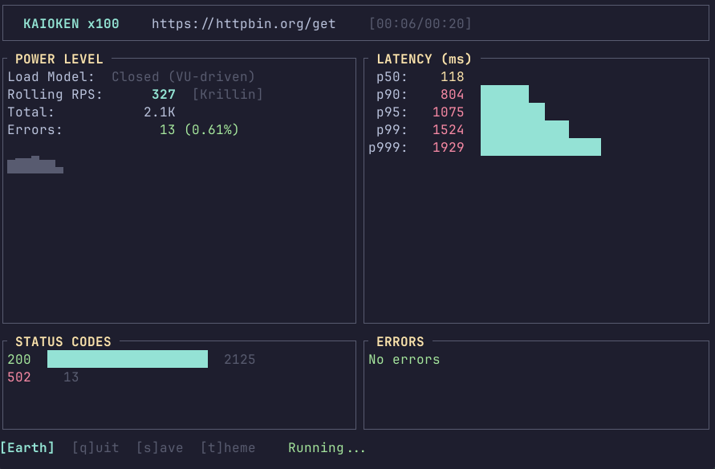

# kaioken

A Rust-based HTTP load testing tool with real-time terminal UI and DBZ flavor.

[](https://crates.io/crates/kaioken)
[](https://github.com/lance0/kaioken#license)

## Features

- **Real-time TUI** - Live metrics with latency percentiles, RPS, status codes
- **Thresholds** - CI/CD pass/fail criteria (p95 < 500ms, error_rate < 0.01, check_pass_rate > 0.95)
- **Checks** - Response validation (status codes, body content, regex) with pass rate tracking
- **Request chaining** - Extract values from responses for subsequent requests
- **Stages** - Multi-phase load profiles (ramp up → hold → ramp down)
- **Weighted scenarios** - Multi-endpoint testing with traffic distribution and tags
- **Cookie jar** - Automatic session handling across requests
- **Rate limiting** - Token bucket algorithm for controlled load
- **Ramp-up & warmup** - Gradual worker activation and connection priming
- **Compare mode** - Regression detection with CI-friendly exit codes
- **Multiple outputs** - JSON, CSV, Markdown, and HTML reports
- **Variable interpolation** - Dynamic `${REQUEST_ID}`, `${TIMESTAMP_MS}`, and extracted values
- **HTTP/2 support** - Optional h2 prior knowledge mode
- **DBZ themes** - 6 color schemes (press `t` to cycle)

## vs Other Tools

| Feature | kaioken | k6 | vegeta | wrk | Gatling |
|---------|:-------:|:--:|:------:|:---:|:-------:|
| **Real-time TUI** | ✅ | ❌ | ❌ | ❌ | ❌ |
| **Zero config** | ✅ | ❌ | ✅ | ✅ | ❌ |
| **Compare mode** | ✅ | ❌ | ❌ | ❌ | ❌ |
| **HTML reports** | ✅ | ✅ | ❌ | ❌ | ✅ |
| **Rate limiting** | ✅ | ✅ | ✅ | ❌ | ✅ |
| **HTTP/2** | ✅ | ✅ | ✅ | ❌ | ✅ |
| **Weighted scenarios** | ✅ | ✅ | ❌ | ❌ | ✅ |
| **Config file** | TOML | JS | JSON | Lua | Scala |
| **Checks/thresholds** | ✅ | ✅ | ❌ | ❌ | ✅ |
| **Stages** | ✅ | ✅ | ❌ | ❌ | ✅ |
| **Request chaining** | ✅ | ✅ | ❌ | ❌ | ✅ |
| **Cookie jar** | ✅ | ✅ | ❌ | ❌ | ✅ |
| **Language** | Rust | Go | Go | C | Scala |

**kaioken strengths:** Real-time visibility, instant feedback, regression detection, CI/CD thresholds, load stages, request chaining, memorable UX

## Installation

```bash
cargo install kaioken
```

## Quick Start

```bash
# Basic test
kaioken run https://api.example.com/health

# With options
kaioken run https://api.example.com/users \
  -c 100 -d 30s -r 500 --warmup 5s

# Fixed number of requests
kaioken run https://api.example.com -n 10000

# Generate starter config
kaioken init --url https://api.example.com

# Validate config without running
kaioken run -f config.toml --dry-run

# Compare two runs for regressions
kaioken compare baseline.json current.json

# Shell completions
kaioken completions bash >> ~/.bashrc
```

## TUI Preview



Press `t` to cycle themes: Earth → Namek → Planet Vegeta → Time Chamber → Tournament → Frieza Force

## CLI Reference

### `kaioken run`

```
kaioken run [OPTIONS] [URL]
```

| Flag | Default | Description |
|------|---------|-------------|
| `[URL]` | — | Target URL (required unless using `-f`) |
| `-c, --concurrency` | 50 | Concurrent workers |
| `-d, --duration` | 10s | Test duration |
| `-n, --max-requests` | 0 | Stop after N requests (0 = unlimited) |
| `-r, --rate` | 0 | Max RPS (0 = unlimited) |
| `--ramp-up` | 0s | Time to reach full concurrency |
| `--warmup` | 0s | Warmup period (not measured) |
| `--think-time` | — | Pause between requests (e.g., 500ms) |
| `-m, --method` | GET | HTTP method |
| `-H, --header` | — | Header (repeatable) |
| `-b, --body` | — | Request body |
| `--body-file` | — | Load body from file |
| `--http2` | false | Use HTTP/2 prior knowledge |
| `--cookie-jar` | false | Enable cookie jar for session handling |
| `-f, --config` | — | TOML config file |
| `-o, --output` | — | Output file path |
| `--format` | json | Output format: json, csv, md, html |
| `--no-tui` | false | Headless mode |
| `--json` | false | Shorthand for `--no-tui --format json` |
| `--dry-run` | false | Validate config and exit |
| `--fail-fast` | false | Abort immediately on threshold breach |
| `--serious` | false | Disable DBZ flavor |
| `--insecure` | false | Skip TLS verification |
| `-y, --yes` | false | Skip remote target confirmation |

### `kaioken compare`

```
kaioken compare <BASELINE> <CURRENT> [OPTIONS]
```

Compare two JSON result files for regressions. Exits with code 3 if regressions detected.

| Flag | Default | Description |
|------|---------|-------------|
| `--threshold-p99` | 10.0 | p99 latency regression threshold (%) |
| `--threshold-p999` | 15.0 | p999 latency regression threshold (%) |
| `--threshold-error-rate` | 50.0 | Error rate regression threshold (%) |
| `--threshold-rps` | 10.0 | RPS regression threshold (%) |
| `--json` | false | Output as JSON |

### `kaioken init`

```
kaioken init [OPTIONS]
```

Generate a starter config file with documented options.

| Flag | Default | Description |
|------|---------|-------------|
| `-o, --output` | kaioken.toml | Output file path |
| `-u, --url` | — | Target URL to include |
| `--force` | false | Overwrite existing file |

### `kaioken completions`

```
kaioken completions <SHELL>
```

Generate shell completions. Supported: `bash`, `zsh`, `fish`, `powershell`, `elvish`.

### `kaioken man`

```
kaioken man > kaioken.1
man -l kaioken.1
```

Generate man page in roff format.

## Config File

```toml
[target]
url = "https://api.example.com/users"
method = "POST"
timeout = "5s"
connect_timeout = "2s"
# http2 = false
# insecure = false
# cookie_jar = false  # Enable for session handling

[target.headers]
Authorization = "Bearer ${API_TOKEN}"
Content-Type = "application/json"

# body = '{"key": "value"}'
# body_file = "payload.json"

[load]
concurrency = 100
duration = "30s"
# max_requests = 0
# rate = 500
# ramp_up = "5s"
# warmup = "3s"
# think_time = "500ms"
```

Environment variables: `${VAR}` or `${VAR:-default}`

## Thresholds

Define pass/fail criteria for CI/CD pipelines:

```toml
[thresholds]
p95_latency_ms = "< 500"
p99_latency_ms = "< 1000"
error_rate = "< 0.01"
rps = "> 100"
check_pass_rate = "> 0.95"  # 95% of checks must pass
```

Available metrics:
- `p50_latency_ms`, `p75_latency_ms`, `p90_latency_ms`, `p95_latency_ms`, `p99_latency_ms`, `p999_latency_ms`
- `mean_latency_ms`, `max_latency_ms`
- `error_rate` (0.0 - 1.0)
- `rps` (requests per second)
- `check_pass_rate` (0.0 - 1.0) - percentage of checks passing

Operators: `<`, `<=`, `>`, `>=`, `==`

Exit codes:
- `0` - Success
- `1` - Error (high error rate)
- `3` - Regressions detected (compare mode)
- `4` - Thresholds failed

## Checks

Validate response status codes and body content:

```toml
[[checks]]
name = "status_ok"
condition = "status == 200"

[[checks]]
name = "success_codes"
condition = "status in [200, 201, 204]"

[[checks]]
name = "has_data"
condition = "body contains \"success\""

[[checks]]
name = "valid_json"
condition = "body matches \"\\{.*\\}\""
```

Check results are displayed after the test with pass/fail percentages.

## Request Chaining

Extract values from responses and use in subsequent requests:

```toml
[[scenarios]]
name = "login"
url = "https://api.example.com/auth"
method = "POST"
body = '{"user": "test", "pass": "secret"}'
weight = 0  # weight=0 means dependency only

[scenarios.extract]
token = "json:$.access_token"
session_id = "header:X-Session-Id"

[[scenarios]]
name = "get_profile"
url = "https://api.example.com/me"
method = "GET"
weight = 10

[scenarios.headers]
Authorization = "Bearer ${token}"
```

Extraction sources:
- `json:$.path.to.value` - JSONPath extraction
- `regex:pattern:group` - Regex capture group
- `body` - Entire response body

Extracted values are available as `${varname}` in URLs, headers, and body.

## Stages

Define multi-phase load profiles (ramp up, hold, ramp down):

```toml
[target]
url = "https://api.example.com/health"

[[stages]]
duration = "30s"
target = 50      # ramp to 50 workers

[[stages]]
duration = "2m"
target = 50      # hold at 50

[[stages]]
duration = "30s"
target = 0       # ramp down to 0
```

When stages are configured:
- Total duration is calculated automatically
- Max worker count is determined from highest target
- Workers ramp up/down gradually within each stage

## Weighted Scenarios

Test multiple endpoints with different traffic ratios:

```toml
[load]
concurrency = 100
duration = "60s"

[[scenarios]]
name = "list_users"
url = "https://api.example.com/users"
method = "GET"
weight = 7  # 70% of traffic
tags = { endpoint = "users", version = "v2" }

[[scenarios]]
name = "create_user"
url = "https://api.example.com/users"
method = "POST"
body = '{"name": "test-${REQUEST_ID}"}'
weight = 2  # 20% of traffic
tags = { endpoint = "users", operation = "write" }

[[scenarios]]
name = "health_check"
url = "https://api.example.com/health"
method = "GET"
weight = 1  # 10% of traffic
```

Tags are optional metadata for organizing and filtering scenarios in output.

Validate with `--dry-run`:
```
$ kaioken run -f config.toml --dry-run
Configuration validated successfully!

Scenarios:   3 defined
  - list_users (GET .../users) weight=7 (70%)
  - create_user (POST .../users) weight=2 (20%)
  - health_check (GET .../health) weight=1 (10%)
Concurrency: 100
Duration:    60s
```

## Variable Interpolation

Available in URL, headers, and body:

| Variable | Description |
|----------|-------------|
| `${REQUEST_ID}` | Unique ID per request (worker_id * 1B + counter) |
| `${TIMESTAMP_MS}` | Current epoch time in milliseconds |

Example:
```bash
kaioken run 'https://api.example.com/items/${REQUEST_ID}' \
  -H 'X-Request-ID: ${REQUEST_ID}' \
  -b '{"ts": ${TIMESTAMP_MS}}'
```

## CI Integration

```yaml
# GitHub Actions example with thresholds
- name: Load test with thresholds
  run: |
    cat > test.toml << EOF
    [target]
    url = "https://api.example.com/health"
    
    [load]
    concurrency = 50
    duration = "30s"
    
    [thresholds]
    p95_latency_ms = "< 500"
    error_rate = "< 0.01"
    EOF
    
    kaioken run -f test.toml --no-tui -o results.json -y
    # Exits with code 4 if thresholds fail

- name: Check for regressions (optional)
  run: |
    kaioken compare baseline.json results.json \
      --threshold-p99 15 --threshold-rps 10
```

## Power Levels

| RPS | Rank |
|-----|------|
| 0-100 | Farmer |
| 101-500 | Krillin |
| 501-1,000 | Piccolo |
| 1,001-5,000 | Vegeta |
| 5,001-9,000 | Goku |
| 9,001+ | OVER 9000 |

## License

Licensed under either of:

- Apache License, Version 2.0 ([LICENSE-APACHE](LICENSE-APACHE))
- MIT license ([LICENSE-MIT](LICENSE-MIT))

at your option.
